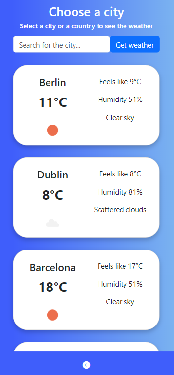
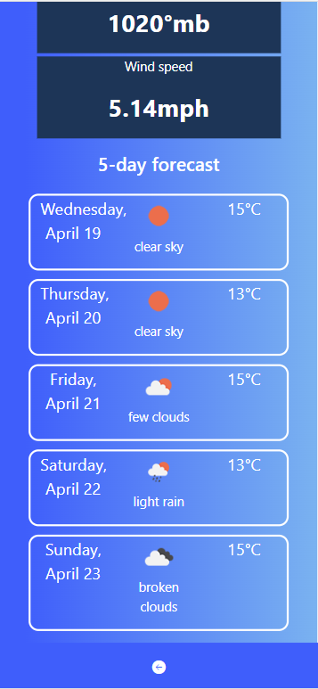
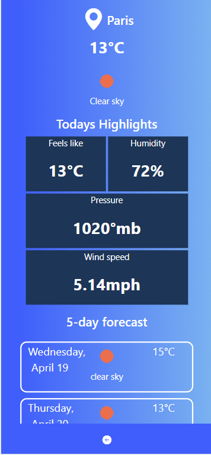

# Weather-app (OpenWeather API)

Weather App is a simple front-end application that allows users to check the current weather conditions for a particular location. It provides real-time weather information, including temperature, humidity, wind speed, and weather description, based on the user's input location.

## About the API

Using: https://openweathermap.org/api

Using: "Current Weather Data"
Documentation: https://openweathermap.org/current

Openweather api allows us to get main description, temperature, temp max,pressure,humidity and much more data.

## How to run the project

Run `npm start` in your terminal.

Runs the app in the development mode.\
Open [http://localhost:3000](http://localhost:3000) to view it in your browser.

The page will reload when you make changes.\
You may also see any lint errors in the console.

Run `npm install`

Create .env file with API KEY to be able to use API.

## Features

Current Weather: Users can enter a location in the search bar to instantly retrieve the current weather conditions, including temperature in Celsius, humidity percentage, wind speed in kilometers per hour, and weather description (e.g., sunny, cloudy, rainy, etc.).

Search Functionality: The app provides a search functionality that allows users to enter any location, such as a city, town, or zip code, and retrieve the current weather information for that location.

Responsive Design: The Weather App is designed to be responsive and mobile-friendly, ensuring a seamless user experience across various devices, including desktops, tablets, and mobile phones.

5-day Forecast: Allows you to get the 5-day forecast for a location of your choice. To use the app, simply enter a location in the input form, and click the "Get weather" button. The app will make a call to a weather API to fetch the forecast data, and display it on result page under current weather.

## Technologies

- VS Code  
- HTML5
- ES6 JavaScript  
- React  
- Git/Github
- React js
- Bootstrap

## Website overview

